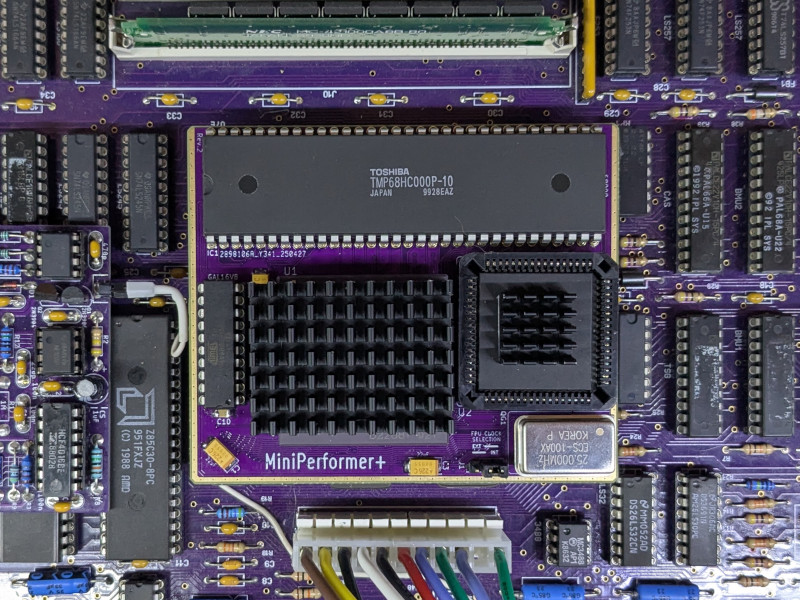
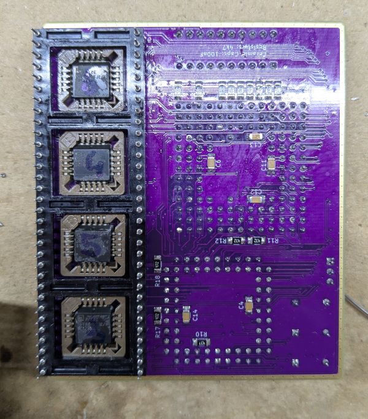

# MicroPerformer+

## DISCLAIMER

Any use of this project is **under your own responsibility**.
You will be responsible of checking the correct construction and functionality of your board.
By using this project You will agree that I cannot be held responsible if it will destroy any of your devices, damage your computer, burn down your house or whatever.

This board is still a work-in-progress, but I've decided to release it as the prototypes seems to work fine, but I'll probably further refine the design to work around some clearance issues.

## Introduction

This board is a remix of the [Micromac Performer](https://github.com/TheRealBolle/Performer-SE-PL-CL) reversed by Bolle,
resized for installation on Macintosh Plus computers. Specifically, on the clone I am using.

### Caveat Emptor

The original Performer had a clip mounted on the underside that allowed it to snap on the motherboard's 68000 without desoldering.
Those clips are now hard to come by, so this accelerator is meant to be installed in place of the 68000, which has to be desoldered and socketed.

This board has not been tested (yet) in an encased Mac Plus. I expect it to fit just fine, provided that the correct pin length is used, but
be warned that You're on your own for now, and encouraged to let me know if it worked out for you.

### Ordering the boards

You can order the board for this project at [PCBWay](https://TODO) and support me or download 
the gerbers and have them printed wherever you like!!!

## Features

- Relatively easy to build, with socketed PLCC ICs
- ~16Mhz 68030 + optional 68882 with choice of clock source: 16Mhz internal or external oscillator

## Hardware

The board was designed with [KiCad](https://kicad.org/) EDA.

### Bill of Materials

| Component              | Qty | Type / Value                                            | Notes                                                                |
| ---------------------- | --- | ------------------------------------------------------- | -------------------------------------------------------------------- |
| R1 - R18               |  18 | 4.7k resistors, 1206                                    |                                                                      |
| C4 - C14               |  11 | 100nF/16V ceramic cap, 1206                             |                                                                      |
| C1 - C3                |  3  | 22uF/16V or 25V tantalum capacitor, 6032                |                                                                      |
| 68000 socket           |  64 | Female machined pins, >=9.7mm length                    | You can source these on AliExpress, here is an [example](https://it.aliexpress.com/item/33019740866.html). |
| QG1                    |  1  | DIP8 or DIP14 oscillator                                | Depending on the 68882, I had luck with frequencies ranging between 25 and 50Mhz |
| U1                     |  1  | 68030, PGA-128 package                                  | Avoid soldering the CPU to the board, use a socket!!!                |
| U2                     |  1  | 68882 FPU, optional, PLCC-68 package, requires socket   | The FPU is optional, to install it, a PLCC-68 THT socket is required |
| U3 - U6                |  4  | PLCC-20 PLDs, 16V8 compatbile, an SMD PLCC socket is required  | I tested both GAL16V8D and AMD PALCE16V8 PLDs for this        |
| U7                     |  1  | DIP-20 PLD, 16V8 compatible                             | Avoid GAL16V8D, tested ATF16V8 and PALCE16V8 without issues          |
| J3                     |  1  | 3 pin 2.54mm header strip                               | Used to switch between internal and external clock source for FPU    |

### Assembly

Start with the smallest SMD components: ceramic caps and resistors, on both sides of the board.
I usually do the 3 tantalum caps right after, then flip the board and install the 4 PLCC-20 sockets.

For the sockets, my usual approach is to snip away the bottom, apply copious flux on the PCB, align the sockets and then
apply solder, no need for hot air here. You do you though.

The nastiest part is installing the round pins in the 68000 footprint. Use a large flat blade screwdriver, and use the flat part of the
screwdriver to push and wiggle the pin completely in. Try not to hurt your fingers (like I did...) in the process.
Once the rows are installed, I usually attach a socket on the pins to keep them in line, apply flux on the pcb, then solder every pin on the underside.

You can keep the through hole sockets and the 3 pin header last.

The PLDs must be programmed, the JED files can be found in [Bolle's repository](https://github.com/TheRealBolle/Performer-SE-PL-CL).

### Known Issues

- CLEARANCE: The bezel around the 68K socket on this accelerator could conflict with RAM on an original Plus, as the RAM sockets are slanted. If the accelerator is raised to make up for the clearance issue, it could end up too high to fit a Macintosh Plus chassis.
- While used without this board, my clone Mac Plus had no issues in using a WDC 65C22 and fast OTP ROMs. With the accelerator installed, it gets a bit finicky on the parts and sometimes refuses to boot at all with those installed.
- Replacing the ROMs with standard 27C512 rated at around 150nS, plus using a plain old 6522 solved all the boot issues for me. No changes should be necessary on a stock Mac Plus, but let me know how it goes for you.
- Also, note that the choice of PLD type for the build is important, especially for U7: I had good luck with PALCE16V8 rated at 25ns or ATF16V8 rated at 15. Pain and tears with GAL16V8D though.

### Future Improvements

- Tweak the placement for the PLD sockets on the underside, so they fit right into DIP64 open-frame socket holes
- Reduce or remove the bezel near the 68K socket to try and improve the clearance for RAM
- Tweak size of the holes for the DIP64 socket, to allow for easier pin insertion.